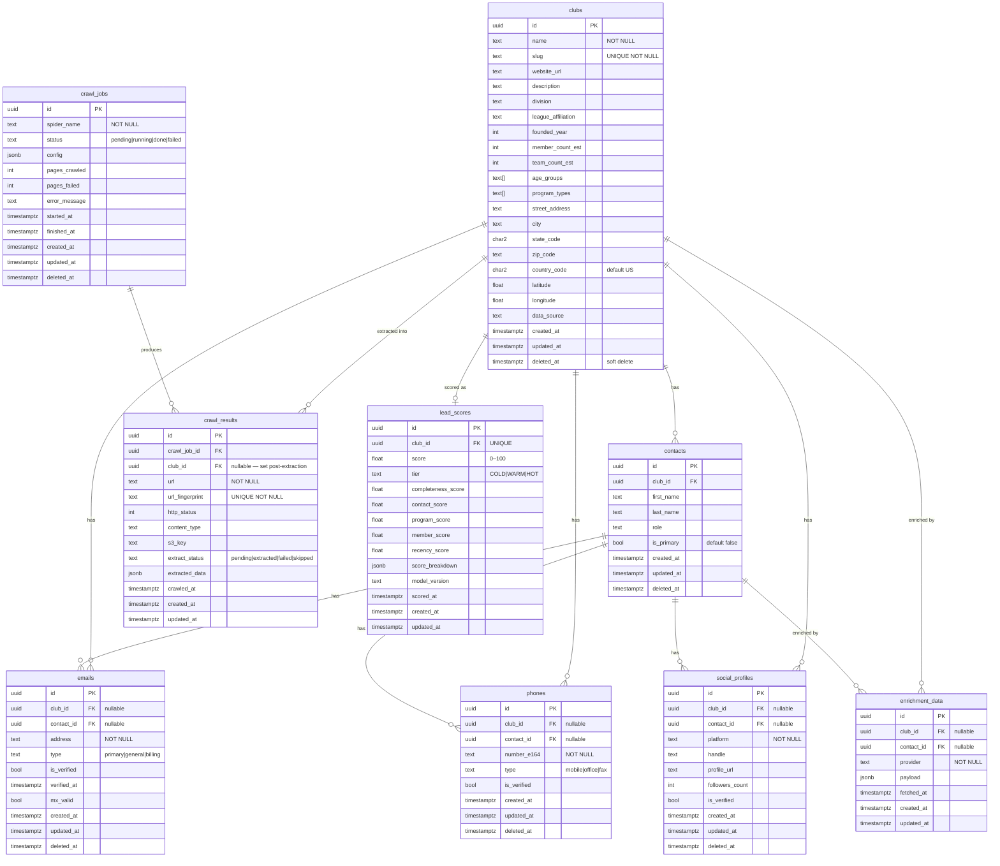

# Soccer Club Lead Gen — Database ERD

All tables live in the `soccer_leads` schema on PostgreSQL 16+.
Extensions required: `pgcrypto`, `pg_trgm`.

## Index Summary

| Table | Index | Type | Notes |
|---|---|---|---|
| clubs | `slug` | UNIQUE BTREE | |
| clubs | `state_code, division` | BTREE | Filter queries |
| clubs | `deleted_at` WHERE NULL | PARTIAL BTREE | Active-row queries |
| clubs | `name` gin_trgm_ops | GIN | Fuzzy name search |
| contacts | `club_id` | BTREE | |
| contacts | `club_id, is_primary` | BTREE | Primary contact lookup |
| contacts | `deleted_at` WHERE NULL | PARTIAL BTREE | |
| emails | `address` | BTREE | Dedup |
| emails | `club_id` WHERE NOT NULL | PARTIAL BTREE | |
| emails | `contact_id` WHERE NOT NULL | PARTIAL BTREE | |
| phones | `number_e164` | BTREE | Dedup |
| phones | `club_id` WHERE NOT NULL | PARTIAL BTREE | |
| social_profiles | `platform, handle` | BTREE | Dedup |
| social_profiles | `club_id` WHERE NOT NULL | PARTIAL BTREE | |
| crawl_jobs | `spider_name, status` | BTREE | |
| crawl_jobs | `started_at DESC` | BTREE | |
| crawl_results | `url_fingerprint` | UNIQUE BTREE | |
| crawl_results | `crawl_job_id` | BTREE | |
| crawl_results | `extract_status` | BTREE | |
| crawl_results | `club_id` WHERE NOT NULL | PARTIAL BTREE | |
| enrichment_data | `club_id, provider` | BTREE | |
| enrichment_data | `contact_id, provider` | BTREE | |
| lead_scores | `club_id` | UNIQUE BTREE | One score per club |
| lead_scores | `tier, score DESC` | BTREE | Ranked list queries |
