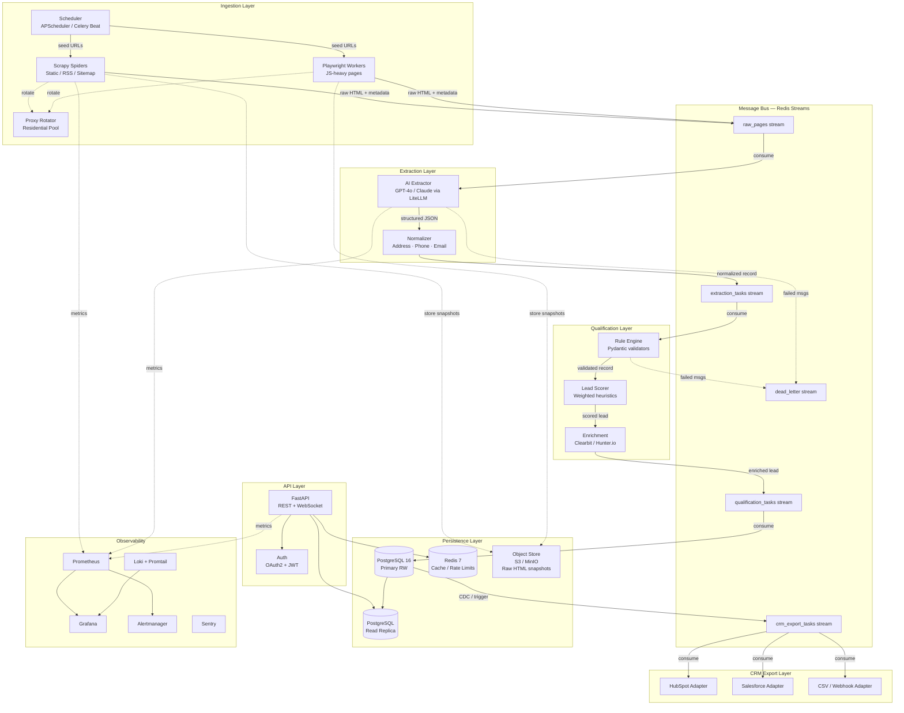
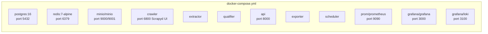
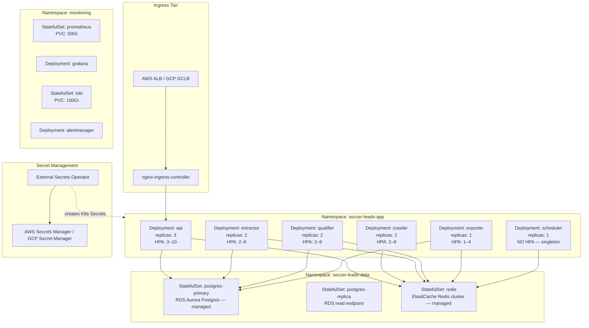
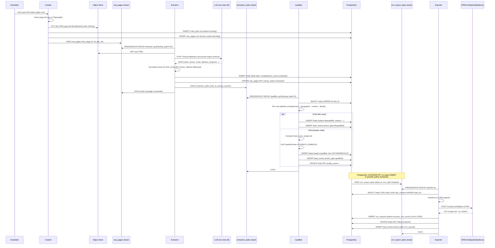

# US Soccer Club Lead Generation Platform — Technical Design Document

**Version:** 1.0  
**Status:** Design Review  
**Date:** 2026-06-02

---

## Table of Contents

1. [High-Level Architecture](#1-high-level-architecture)
2. [Folder Structure](#2-folder-structure)
3. [Database Schema](#3-database-schema)
4. [Service Boundaries](#4-service-boundaries)
5. [Deployment Architecture](#5-deployment-architecture)
6. [Event Flow](#6-event-flow)
7. [Scaling Strategy](#7-scaling-strategy)
8. [Monitoring Strategy](#8-monitoring-strategy)
9. [Security Considerations](#9-security-considerations)
10. [Technology Choices and Rationale](#10-technology-choices-and-rationale)

---

## 1. High-Level Architecture



---

## 2. Folder Structure

```
soccer-leads/
│
├── .env.example                    # Template — never committed with real values
├── .github/
│   └── workflows/
│       ├── ci.yml                  # Lint, test, type-check on PR
│       └── deploy.yml              # Build → push → helm upgrade
│
├── docker/
│   ├── docker-compose.yml          # Full local stack (all services)
│   ├── docker-compose.dev.yml      # Overlay: hot-reload, debug ports
│   └── docker-compose.test.yml     # Overlay: test DB, mock LLM
│
├── helm/
│   └── soccer-leads/
│       ├── Chart.yaml
│       ├── values.yaml             # Defaults
│       ├── values.prod.yaml        # Production overrides
│       └── templates/
│           ├── deployment-*.yaml
│           ├── service-*.yaml
│           ├── hpa-*.yaml
│           ├── configmap.yaml
│           ├── secret.yaml         # References ExternalSecret CRD
│           └── ingress.yaml
│
├── services/
│   │
│   ├── crawler/                    # Scrapy + Playwright ingestion service
│   │   ├── Dockerfile
│   │   ├── pyproject.toml
│   │   ├── crawler/
│   │   │   ├── settings.py         # Scrapy settings (CONCURRENT_REQUESTS, etc.)
│   │   │   ├── middlewares.py      # Proxy rotation, retry, dedup fingerprint
│   │   │   ├── pipelines.py        # Publish to raw_pages stream
│   │   │   ├── spiders/
│   │   │   │   ├── base.py         # BaseClubSpider (common logic)
│   │   │   │   ├── usasa.py        # USASA.com directory spider
│   │   │   │   ├── ussoccer.py     # US Soccer affiliate pages spider
│   │   │   │   ├── ayso.py         # AYSO regional spider
│   │   │   │   └── google_maps.py  # Google Places API spider
│   │   │   └── playwright_workers/
│   │   │       ├── worker.py       # Async Playwright consumer
│   │   │       └── tasks.py        # JS-rendered page fetch + screenshot
│   │   └── tests/
│   │
│   ├── extractor/                  # AI extraction + normalization service
│   │   ├── Dockerfile
│   │   ├── pyproject.toml
│   │   ├── extractor/
│   │   │   ├── consumer.py         # Redis Streams consumer group
│   │   │   ├── ai_client.py        # LiteLLM wrapper (model routing)
│   │   │   ├── prompts.py          # Versioned extraction prompts
│   │   │   ├── normalizers/
│   │   │   │   ├── address.py      # USPS/libpostal normalization
│   │   │   │   ├── phone.py        # phonenumbers lib, E.164
│   │   │   │   └── email.py        # Syntax + MX validation
│   │   │   └── schemas.py          # Pydantic v2 models for extracted data
│   │   └── tests/
│   │
│   ├── qualifier/                  # Rule engine + scoring + enrichment
│   │   ├── Dockerfile
│   │   ├── pyproject.toml
│   │   ├── qualifier/
│   │   │   ├── consumer.py         # Redis Streams consumer group
│   │   │   ├── rules/
│   │   │   │   ├── engine.py       # Ordered rule pipeline
│   │   │   │   ├── completeness.py # Required-field coverage check
│   │   │   │   ├── duplicates.py   # Fingerprint-based dedup against DB
│   │   │   │   └── geographic.py   # US state validation, lat/lng bounds
│   │   │   ├── scorer.py           # Weighted score → COLD/WARM/HOT
│   │   │   └── enrichment/
│   │   │       ├── clearbit.py
│   │   │       └── hunter.py
│   │   └── tests/
│   │
│   ├── api/                        # FastAPI REST + WebSocket gateway
│   │   ├── Dockerfile
│   │   ├── pyproject.toml
│   │   ├── api/
│   │   │   ├── main.py             # App factory, lifespan hooks
│   │   │   ├── routers/
│   │   │   │   ├── leads.py        # GET /leads, GET /leads/{id}, PATCH
│   │   │   │   ├── clubs.py        # GET /clubs, search, filters
│   │   │   │   ├── jobs.py         # GET /jobs (crawler job status)
│   │   │   │   └── exports.py      # POST /exports (trigger CRM push)
│   │   │   ├── auth/
│   │   │   │   ├── oauth2.py       # OAuth2 flows (Google, internal)
│   │   │   │   └── jwt.py          # Token issue / verify
│   │   │   ├── deps.py             # FastAPI dependency injection
│   │   │   ├── schemas.py          # Request/response Pydantic models
│   │   │   └── middleware/
│   │   │       ├── ratelimit.py    # Redis-backed sliding window
│   │   │       └── logging.py      # Structured JSON request logging
│   │   └── tests/
│   │
│   ├── exporter/                   # CRM export adapters
│   │   ├── Dockerfile
│   │   ├── pyproject.toml
│   │   ├── exporter/
│   │   │   ├── consumer.py         # Redis Streams consumer group
│   │   │   ├── adapters/
│   │   │   │   ├── base.py         # Abstract CRMAdapter interface
│   │   │   │   ├── hubspot.py      # HubSpot v3 API adapter
│   │   │   │   ├── salesforce.py   # Salesforce REST/Bulk API adapter
│   │   │   │   └── csv_webhook.py  # Generic CSV / webhook adapter
│   │   │   └── retry.py            # Exponential backoff, DLQ escalation
│   │   └── tests/
│   │
│   └── scheduler/                  # Job scheduling (APScheduler)
│       ├── Dockerfile
│       ├── pyproject.toml
│       ├── scheduler/
│       │   ├── main.py             # APScheduler setup
│       │   ├── jobs/
│       │   │   ├── crawl_seeds.py  # Re-crawl known directories
│       │   │   ├── re_qualify.py   # Re-score stale leads
│       │   │   └── export_retry.py # Retry failed CRM exports
│       │   └── registry.py         # Job definitions + cron expressions
│       └── tests/
│
├── libs/                           # Shared internal Python packages
│   ├── shared_models/              # SQLAlchemy ORM models (shared)
│   ├── shared_schemas/             # Pydantic cross-service contracts
│   ├── redis_client/               # Thin Redis Streams helper
│   └── observability/              # Prometheus instrumentation helpers
│
├── infra/
│   ├── terraform/                  # IaC for cloud provider (AWS/GCP)
│   │   ├── modules/
│   │   │   ├── vpc/
│   │   │   ├── eks/
│   │   │   ├── rds/
│   │   │   └── elasticache/
│   │   └── envs/
│   │       ├── staging/
│   │       └── production/
│   └── k8s/
│       └── namespaces.yaml
│
├── migrations/                     # Alembic (single source of truth)
│   ├── env.py
│   ├── script.py.mako
│   └── versions/
│       └── 0001_initial_schema.py
│
└── docs/
    ├── adr/                        # Architecture Decision Records
    │   ├── 001-redis-streams-over-kafka.md
    │   └── 002-litellm-abstraction.md
    └── runbooks/
        ├── dlq-triage.md
        └── scaling-crawler.md
```

---

## 3. Database Schema

All tables live in a `leads` schema inside a `soccer_leads` database. PostgreSQL 16+ with `pgcrypto` and `postgis` extensions enabled.

---

### 3.1 Entity Relationship Overview

```mermaid
erDiagram
    crawl_jobs ||--o{ raw_pages : "produces"
    raw_pages ||--o| clubs : "extracted into"
    clubs ||--o{ club_contacts : "has"
    clubs ||--o{ leads : "becomes"
    leads ||--o{ lead_events : "has history"
    leads ||--o{ crm_exports : "exported via"
    users ||--o{ leads : "owns"
    users ||--o{ crm_exports : "triggers"

    crawl_jobs {
        uuid id PK
        text spider_name
        text status
        jsonb config
        int pages_crawled
        int pages_failed
        timestamptz started_at
        timestamptz finished_at
        timestamptz created_at
    }

    raw_pages {
        uuid id PK
        uuid crawl_job_id FK
        text url
        text url_fingerprint
        int http_status
        text content_type
        text s3_key
        text extract_status
        timestamptz crawled_at
        timestamptz created_at
    }

    clubs {
        uuid id PK
        uuid source_raw_page_id FK
        text name
        text slug
        text website_url
        text phone_e164
        text email
        text street_address
        text city
        text state_code
        text zip_code
        geometry location
        text division
        text league_affiliation
        int founded_year
        int member_count_est
        int team_count_est
        text[] age_groups
        text[] program_types
        text description
        float completeness_score
        float quality_score
        text data_source
        text extraction_model
        text extraction_prompt_version
        jsonb raw_extracted_json
        timestamptz first_seen_at
        timestamptz last_updated_at
        timestamptz created_at
    }

    club_contacts {
        uuid id PK
        uuid club_id FK
        text role
        text first_name
        text last_name
        text email
        text phone_e164
        text linkedin_url
        boolean is_primary
        timestamptz created_at
    }

    leads {
        uuid id PK
        uuid club_id FK
        uuid owner_user_id FK
        text status
        text tier
        float lead_score
        jsonb score_breakdown
        text disqualification_reason
        boolean is_duplicate
        uuid duplicate_of_lead_id FK
        timestamptz qualified_at
        timestamptz assigned_at
        timestamptz created_at
        timestamptz updated_at
    }

    lead_events {
        uuid id PK
        uuid lead_id FK
        text event_type
        jsonb payload
        text actor_type
        uuid actor_id
        timestamptz occurred_at
    }

    crm_exports {
        uuid id PK
        uuid lead_id FK
        uuid triggered_by FK
        text crm_type
        text crm_record_id
        text status
        int attempt_count
        text last_error
        jsonb request_payload
        jsonb response_payload
        timestamptz last_attempted_at
        timestamptz exported_at
        timestamptz created_at
    }

    users {
        uuid id PK
        text email
        text name
        text role
        text oauth_provider
        text oauth_subject
        timestamptz created_at
        timestamptz updated_at
    }
```



---

### 3.2 Detailed Table Definitions

#### `leads.crawl_jobs`

| Column | Type | Constraints | Notes |
|---|---|---|---|
| `id` | `uuid` | PK, default `gen_random_uuid()` | |
| `spider_name` | `text` | NOT NULL | e.g. `usasa`, `ayso` |
| `status` | `text` | NOT NULL, CHECK IN (`pending`,`running`,`done`,`failed`) | |
| `config` | `jsonb` | NOT NULL, default `'{}'` | Spider-specific overrides |
| `pages_crawled` | `int` | NOT NULL, default `0` | |
| `pages_failed` | `int` | NOT NULL, default `0` | |
| `started_at` | `timestamptz` | | |
| `finished_at` | `timestamptz` | | |
| `created_at` | `timestamptz` | NOT NULL, default `now()` | |

Indexes: `(spider_name, status)`, `(started_at DESC)`

---

#### `leads.raw_pages`

| Column | Type | Constraints | Notes |
|---|---|---|---|
| `id` | `uuid` | PK | |
| `crawl_job_id` | `uuid` | FK → `crawl_jobs.id`, ON DELETE SET NULL | |
| `url` | `text` | NOT NULL | Original URL |
| `url_fingerprint` | `text` | NOT NULL, UNIQUE | SHA-256 of canonicalized URL |
| `http_status` | `int` | NOT NULL | |
| `content_type` | `text` | | |
| `s3_key` | `text` | NOT NULL | Path to raw HTML in object store |
| `extract_status` | `text` | NOT NULL, default `pending` | `pending`,`extracted`,`failed`,`skipped` |
| `crawled_at` | `timestamptz` | NOT NULL | |
| `created_at` | `timestamptz` | NOT NULL, default `now()` | |

Indexes: `(url_fingerprint)` UNIQUE, `(extract_status)`, `(crawl_job_id)`, `(crawled_at DESC)`

---

#### `leads.clubs`

| Column | Type | Constraints | Notes |
|---|---|---|---|
| `id` | `uuid` | PK | |
| `source_raw_page_id` | `uuid` | FK → `raw_pages.id` | Lineage back to raw HTML |
| `name` | `text` | NOT NULL | |
| `slug` | `text` | NOT NULL, UNIQUE | URL-safe identifier |
| `website_url` | `text` | | |
| `phone_e164` | `text` | | Normalized E.164 |
| `email` | `text` | | Validated syntax + MX |
| `street_address` | `text` | | |
| `city` | `text` | | |
| `state_code` | `char(2)` | CHECK IN US state codes | |
| `zip_code` | `text` | | |
| `location` | `geometry(Point,4326)` | | PostGIS lat/lng for geo queries |
| `division` | `text` | | e.g. `adult_amateur`, `youth_rec` |
| `league_affiliation` | `text` | | e.g. `USASA`, `US Youth Soccer` |
| `founded_year` | `int` | CHECK `> 1850 AND < 2030` | |
| `member_count_est` | `int` | | |
| `team_count_est` | `int` | | |
| `age_groups` | `text[]` | | e.g. `{U8,U10,Adult}` |
| `program_types` | `text[]` | | e.g. `{recreational,competitive,futsal}` |
| `description` | `text` | | |
| `completeness_score` | `float` | CHECK `0.0–1.0` | Fraction of non-null key fields |
| `quality_score` | `float` | CHECK `0.0–1.0` | Weighted quality signal |
| `data_source` | `text` | NOT NULL | Spider name or API |
| `extraction_model` | `text` | | e.g. `gpt-4o-2024-08-06` |
| `extraction_prompt_version` | `text` | | e.g. `v2.1` |
| `raw_extracted_json` | `jsonb` | | Full LLM output for audit |
| `first_seen_at` | `timestamptz` | NOT NULL, default `now()` | |
| `last_updated_at` | `timestamptz` | NOT NULL, default `now()` | |
| `created_at` | `timestamptz` | NOT NULL, default `now()` | |

Indexes:
- `(slug)` UNIQUE
- `(state_code, division)`
- `(completeness_score DESC)`
- `(quality_score DESC)`
- `GiST (location)` for PostGIS spatial queries
- `GIN (age_groups)` for array containment
- `GIN (program_types)` for array containment
- `(last_updated_at DESC)`

---

#### `leads.leads`

| Column | Type | Constraints | Notes |
|---|---|---|---|
| `id` | `uuid` | PK | |
| `club_id` | `uuid` | FK → `clubs.id` NOT NULL | |
| `owner_user_id` | `uuid` | FK → `users.id` | NULL until assigned |
| `status` | `text` | NOT NULL | `new`,`qualified`,`disqualified`,`assigned`,`exported`,`converted` |
| `tier` | `text` | | `COLD`, `WARM`, `HOT` |
| `lead_score` | `float` | CHECK `0.0–100.0` | Weighted composite score |
| `score_breakdown` | `jsonb` | | Per-dimension scores |
| `disqualification_reason` | `text` | | Populated when status=disqualified |
| `is_duplicate` | `bool` | NOT NULL, default `false` | |
| `duplicate_of_lead_id` | `uuid` | FK → `leads.id` | Self-referential |
| `qualified_at` | `timestamptz` | | |
| `assigned_at` | `timestamptz` | | |
| `created_at` | `timestamptz` | NOT NULL, default `now()` | |
| `updated_at` | `timestamptz` | NOT NULL, default `now()` | Trigger-maintained |

Indexes: `(status, tier)`, `(owner_user_id)`, `(club_id)` UNIQUE (prevents double-lead for same club), `(lead_score DESC)`, `(created_at DESC)`

---

#### `leads.lead_events`

| Column | Type | Notes |
|---|---|---|
| `id` | `uuid` | PK |
| `lead_id` | `uuid` | FK → `leads.id`, NOT NULL, ON DELETE CASCADE |
| `event_type` | `text` | `created`, `qualified`, `score_updated`, `exported`, `crm_synced`, `disqualified` |
| `payload` | `jsonb` | Before/after state, or event-specific data |
| `actor_type` | `text` | `system`, `user`, `scheduler` |
| `actor_id` | `uuid` | User ID or service identifier |
| `occurred_at` | `timestamptz` | NOT NULL, default `now()` |

Indexes: `(lead_id, occurred_at DESC)`, `(event_type)` — this table is append-only, partition by `occurred_at` monthly.

---

#### `leads.crm_exports`

| Column | Type | Notes |
|---|---|---|
| `id` | `uuid` | PK |
| `lead_id` | `uuid` | FK → `leads.id`, NOT NULL |
| `triggered_by` | `uuid` | FK → `users.id` (or NULL for auto-export) |
| `crm_type` | `text` | `hubspot`, `salesforce`, `csv`, `webhook` |
| `crm_record_id` | `text` | Foreign key in the CRM |
| `status` | `text` | `pending`, `success`, `failed`, `retrying` |
| `attempt_count` | `int` | NOT NULL, default `0` |
| `last_error` | `text` | |
| `request_payload` | `jsonb` | Audit of what was sent |
| `response_payload` | `jsonb` | Full CRM API response |
| `last_attempted_at` | `timestamptz` | |
| `exported_at` | `timestamptz` | Populated on success |
| `created_at` | `timestamptz` | NOT NULL, default `now()` |

Indexes: `(lead_id, crm_type)`, `(status, last_attempted_at)` for retry queries.

---

## 4. Service Boundaries

### 4.1 Crawler Service

**Responsibility:** Discover and fetch soccer club pages from seed URLs and directory sites. Produces raw HTML snapshots. Does not interpret content.

**Owns:** `crawl_jobs`, `raw_pages` tables. S3 raw HTML objects.

**Publishes to:** `raw_pages` Redis Stream (message: `{raw_page_id, s3_key, url, content_type, crawl_job_id}`)

**Consumes from:** Scheduler seed-URL directives (via direct invocation or `crawl_seeds` Redis Stream)

**Interface Contract (outbound message schema):**
```
stream:   raw_pages
fields:
  raw_page_id:  uuid
  s3_key:       string  (e.g. "raw/2026/06/02/<uuid>.html.gz")
  url:          string
  content_type: string
  crawl_job_id: uuid
  crawled_at:   ISO8601 string
```

**External dependencies:** Target websites, Proxy provider (e.g. Oxylabs / Bright Data), S3-compatible object store.

**Key environment variables:** `PROXY_ENDPOINT`, `PROXY_USER`, `PROXY_PASS`, `S3_BUCKET`, `REDIS_URL`, `SCRAPY_CONCURRENT_REQUESTS`, `PLAYWRIGHT_INSTANCES`

**Does NOT:** Parse HTML, make database writes to any table it does not own, call external APIs beyond target sites and proxy.

---

### 4.2 Extractor Service

**Responsibility:** Consume raw HTML from the `raw_pages` stream, call the AI extraction layer to identify structured club data, normalize fields (phone, email, address), and publish structured records downstream.

**Owns:** Updates `extract_status` on `raw_pages`. Inserts rows into `clubs` (initial draft state).

**Publishes to:** `extraction_tasks` Redis Stream (message: `{club_id, extraction_model, prompt_version, raw_extracted_json}`)

**Consumes from:** `raw_pages` Redis Stream

**Interface Contract (outbound message schema):**
```
stream:   extraction_tasks
fields:
  club_id:               uuid
  extraction_model:      string
  prompt_version:        string
  completeness_score:    float
  source_raw_page_id:    uuid
```

**External dependencies:** LLM API (via LiteLLM router), `libpostal` for address parsing, `phonenumbers` library, S3 (to read raw HTML).

**Key environment variables:** `LITELLM_BASE_URL`, `OPENAI_API_KEY`, `ANTHROPIC_API_KEY`, `LITELLM_MODEL_PRIMARY`, `LITELLM_MODEL_FALLBACK`, `REDIS_URL`, `S3_BUCKET`, `DB_WRITE_URL`

**Does NOT:** Apply business qualification rules, score leads, call CRM APIs.

---

### 4.3 Qualifier Service

**Responsibility:** Validate extracted club records against business rules, compute a weighted lead score, classify leads into COLD/WARM/HOT tiers, run deduplication, and optionally enrich via third-party APIs.

**Owns:** Inserts into `leads` table. Updates `clubs.quality_score`. Appends to `lead_events`.

**Publishes to:** `qualification_tasks` Redis Stream (message: `{lead_id, tier, lead_score, status}`)

**Consumes from:** `extraction_tasks` Redis Stream

**Rule Engine — ordered pipeline:**
1. `CompletenessRule` — reject if completeness_score < 0.4
2. `GeographicRule` — reject if state_code not in valid US states
3. `ContactRule` — downgrade if no email AND no phone
4. `DuplicateRule` — fingerprint = SHA-256(normalized_name + zip_code); mark duplicate if match exists within 90 days
5. `AgeGroupRule` — bonus score if youth programs present (higher LTV signal)

**Scoring weights:**

| Dimension | Weight |
|---|---|
| Completeness | 25% |
| Contact reachability | 30% |
| Program type breadth | 15% |
| Member count estimate | 15% |
| Recency of data | 15% |

HOT ≥ 75, WARM 40–74, COLD < 40.

**Key environment variables:** `CLEARBIT_API_KEY`, `HUNTER_API_KEY`, `REDIS_URL`, `DB_WRITE_URL`, `ENRICH_ENABLED`

**Does NOT:** Crawl pages, call LLMs, push to CRM.

---

### 4.4 API Service (FastAPI)

**Responsibility:** Provide a REST + WebSocket interface for human operators and downstream integrations. Read-heavy; uses the read replica. Triggers manual CRM exports.

**Owns:** No tables (read from `PG_RO`, writes go through internal service calls or direct to `leads` / `users` via the write primary).

**Exposes:**

| Method | Path | Description |
|---|---|---|
| GET | `/v1/leads` | Paginated lead list, filterable by status/tier/state/score |
| GET | `/v1/leads/{id}` | Single lead detail with events |
| PATCH | `/v1/leads/{id}` | Update status, assign owner |
| GET | `/v1/clubs` | Paginated club list, geo search via PostGIS |
| GET | `/v1/clubs/{id}` | Full club profile |
| GET | `/v1/jobs` | Crawl job list + status |
| POST | `/v1/jobs` | Trigger new crawl job (admin role only) |
| POST | `/v1/exports` | Trigger CRM export for a lead |
| GET | `/v1/exports/{id}` | Export status |
| WS | `/v1/ws/leads` | Real-time lead qualification feed |

**Auth:** OAuth2 + JWT. Tokens issued with 1-hour expiry; refresh tokens stored in Redis with 7-day sliding window. Role: `viewer`, `operator`, `admin`.

**Key environment variables:** `JWT_SECRET_KEY`, `OAUTH_GOOGLE_CLIENT_ID`, `OAUTH_GOOGLE_CLIENT_SECRET`, `DB_READ_URL`, `DB_WRITE_URL`, `REDIS_URL`

**Does NOT:** Run crawlers, call LLMs, speak directly to CRM APIs.

---

### 4.5 Exporter Service

**Responsibility:** Consume export tasks, transform lead+club records into CRM-specific payloads, push via CRM APIs, record outcomes, and handle retries with exponential backoff.

**Owns:** Writes to `crm_exports`. Updates `leads.status` to `exported`.

**Consumes from:** `crm_export_tasks` Redis Stream

**Adapter interface contract (`base.py`):**
```
class CRMAdapter:
    def transform(self, lead: LeadExportPayload) -> dict
    def push(self, payload: dict) -> CRMResult
    def handle_rate_limit(self, retry_after: int) -> None
```

**Retry policy:** Max 5 attempts. Backoff: `min(2^attempt * 10s, 600s)`. After 5 failures → escalate to `dead_letter` stream and set `crm_exports.status = failed`.

**Key environment variables:** `HUBSPOT_API_KEY`, `SALESFORCE_CLIENT_ID`, `SALESFORCE_CLIENT_SECRET`, `SALESFORCE_INSTANCE_URL`, `REDIS_URL`, `DB_WRITE_URL`

**Does NOT:** Apply qualification rules, fetch raw pages, query LLMs.

---

### 4.6 Scheduler Service

**Responsibility:** Emit crawl-seed events on a cron schedule, trigger re-qualification of stale leads, and submit retry jobs for failed exports.

**Owns:** No data tables. Writes job configuration into the `raw_pages` stream or directly into `crawl_jobs` via the write DB.

**Jobs:**

| Job Name | Schedule | Description |
|---|---|---|
| `crawl_seeds` | `0 2 * * *` (daily 2am UTC) | Re-crawl all registered seed directories |
| `re_qualify_stale` | `0 6 * * 0` (weekly Sunday 6am UTC) | Re-score leads last updated > 30 days ago |
| `retry_failed_exports` | `*/30 * * * *` (every 30 min) | Push failed CRM exports back to queue |
| `snapshot_metrics` | `0 * * * *` (hourly) | Write aggregated counts to DB for dashboard |

**Key environment variables:** `DB_WRITE_URL`, `REDIS_URL`, `SCHEDULER_TZ`

---

## 5. Deployment Architecture

### 5.1 Local Development — Docker Compose



Key `docker-compose.yml` features:
- All services share a `soccer-leads-net` bridge network
- `postgres` uses a named volume `pg_data`, with `healthcheck` before dependent services start (`depends_on: condition: service_healthy`)
- `POSTGRES_PASSWORD`, `REDIS_PASSWORD`, `MINIO_ROOT_PASSWORD` pulled from `.env` file (never committed)
- `api` mounts `./services/api:/app` for hot-reload via `uvicorn --reload`
- `migrations` service runs `alembic upgrade head` as a one-shot init container before `api` starts

---

### 5.2 Production — Kubernetes

**Cluster topology (EKS / GKE):**



**Kubernetes resource types used:**

| Resource | Purpose |
|---|---|
| `Deployment` | Stateless services (api, extractor, qualifier, exporter, crawler) |
| `StatefulSet` | Stateful services if self-hosted (Prometheus, Loki) |
| `HorizontalPodAutoscaler` | CPU/memory-based autoscaling per service |
| `PodDisruptionBudget` | Minimum availability during rolling updates |
| `ConfigMap` | Non-secret configuration (Prometheus scrape config, Grafana datasources) |
| `Secret` (via ESO) | API keys, DB passwords, JWT secret |
| `ServiceAccount` + IRSA | AWS IAM role for S3 access from crawler/extractor pods |
| `NetworkPolicy` | Restrict pod-to-pod communication to declared paths only |
| `CronJob` | Alembic migration runs; one-off data repair jobs |
| `Ingress` | HTTPS termination, routing to `api` service |
| `PodAntiAffinity` | Spread `api` replicas across availability zones |
| `ResourceQuota` | Per-namespace CPU/memory caps |

**Pod resource requests/limits (examples):**

| Service | CPU Request | CPU Limit | Memory Request | Memory Limit |
|---|---|---|---|---|
| `api` | 250m | 1000m | 256Mi | 512Mi |
| `crawler` | 500m | 2000m | 512Mi | 1Gi |
| `extractor` | 500m | 2000m | 512Mi | 2Gi |
| `qualifier` | 250m | 1000m | 256Mi | 512Mi |
| `exporter` | 100m | 500m | 128Mi | 256Mi |
| `scheduler` | 100m | 250m | 128Mi | 256Mi |

---

## 6. Event Flow

### 6.1 Lead Lifecycle — End to End



---

### 6.2 Dead Letter Handling

When a message fails after all retries within a consumer group:

1. The service calls `XADD dead_letter {original_stream, message_id, error, service, attempt_count, payload}`
2. The `dead_letter` stream is monitored by Prometheus via a custom exporter
3. An alert fires if `dead_letter` stream length > 10 (configurable `ALERT_DLQ_THRESHOLD`)
4. An on-call engineer runs `docs/runbooks/dlq-triage.md` to replay or discard
5. The original message is acknowledged in the source stream to prevent indefinite blocking

---

### 6.3 CRM Trigger Mechanism

Leads flow to the `crm_export_tasks` stream via two paths:

- **Auto-export:** A PostgreSQL `NOTIFY leads_channel` fires on `INSERT INTO leads WHERE tier IN ('HOT','WARM')`. The Scheduler service listens via `asyncpg.connect().add_listener()` and publishes to `crm_export_tasks`.
- **Manual export:** An operator calls `POST /v1/exports` on the API. The API writes directly to `crm_export_tasks` and returns a `202 Accepted` with an export job ID.

---

## 7. Scaling Strategy

### 7.1 Per-Service Scaling

| Service | Scaling Axis | Trigger | Strategy |
|---|---|---|---|
| `crawler` | Horizontal | Pending URL queue depth > 1000 | HPA on custom metric: `crawler_pending_urls_total`. Each pod independently processes URLs; stateless. |
| `extractor` | Horizontal | `raw_pages` stream pending-entries-count > 500 | HPA on KEDA `RedisStreams` scaler — `pendingEntriesCount` metric. LLM calls are I/O-bound; scale to concurrency. |
| `qualifier` | Horizontal | `extraction_tasks` stream pending > 200 | KEDA `RedisStreams` scaler. CPU-bound rule engine scales linearly. |
| `exporter` | Horizontal | `crm_export_tasks` stream pending > 50 | KEDA `RedisStreams` scaler. Throttled by CRM API rate limits; coordinate via Redis token bucket. |
| `api` | Horizontal | CPU > 70% sustained 2 min | Standard HPA on CPU/memory. Stateless; reads go to read replica. |
| `scheduler` | Fixed 1 replica | N/A — singleton | Leader election via Redis `SET scheduler_leader <pod-id> EX 30 NX` pattern. |
| PostgreSQL | Vertical + Read Replicas | p95 query latency > 200ms | Add read replicas for read-heavy API; vertical scale primary for write throughput. |
| Redis | Cluster mode | Memory > 70% | Enable Redis Cluster; partition streams across shards by service namespace. |

---

### 7.2 KEDA ScaledObject Example (Extractor)

The Extractor's ScaledObject references the `raw_pages` Redis Stream consumer group pending count:

```
ScaledObject: extractor-scaledobject
Namespace:    soccer-leads-app
Target:       Deployment/extractor
Min replicas: 2
Max replicas: 12
Trigger type: redis-streams
  address:           redis.soccer-leads-data.svc:6379
  stream:            raw_pages
  consumerGroup:     extractor-cg
  pendingEntriesCount: 500
  activationPendingEntriesCount: 10
```

---

### 7.3 Queue Depth Management

**Redis Stream backpressure:** Each producer checks stream length before writing using `XLEN`. If `raw_pages` length > `MAX_STREAM_LENGTH` (default `50000`), the crawler pauses new fetches for 60 seconds and increments `crawler_backpressure_total` Prometheus counter.

**Crawler rate limiting:** Scrapy's `AUTOTHROTTLE_ENABLED = True` with `AUTOTHROTTLE_TARGET_CONCURRENCY = 4.0`. Per-domain delay enforced via `DOWNLOAD_DELAY = 1.5`. Playwright workers use a Redis-backed `token_bucket:{domain}` key with `EXPIRE 1` to enforce 1 req/sec per domain.

**LLM rate limiting:** LiteLLM's `max_parallel_requests` capped at 20. If OpenAI returns 429, the extractor exponentially backs off and publishes the raw_page_id back to a `retry_extraction` sub-stream with a `not_before` timestamp, consumed only after the delay.

---

### 7.4 Database Connection Pooling

All services use `asyncpg` with `PgBouncer` in transaction-mode pooling in front of both primary and replica:

| Parameter | Value |
|---|---|
| `pool_size` per service pod | 5 |
| `max_overflow` | 10 |
| `pool_timeout` | 30s |
| PgBouncer `max_client_conn` | 500 |
| PgBouncer `default_pool_size` | 20 |

---

## 8. Monitoring Strategy

### 8.1 Metrics — Prometheus

**Instrumentation library:** `prometheus_client` (Python) with a `libs/observability` shared wrapper.

**Key metrics per service:**

| Metric Name | Type | Labels | Description |
|---|---|---|---|
| `crawler_pages_fetched_total` | Counter | `spider`, `status_code` | Total pages fetched |
| `crawler_pages_failed_total` | Counter | `spider`, `error_type` | Fetch failures |
| `crawler_pending_urls_gauge` | Gauge | `spider` | Pending URL queue depth |
| `extractor_pages_processed_total` | Counter | `status`, `model` | Pages through AI extraction |
| `extractor_llm_latency_seconds` | Histogram | `model`, `provider` | LLM call duration (buckets: .5, 1, 2, 5, 10, 30) |
| `extractor_llm_cost_total` | Counter | `model` | Estimated token cost in USD |
| `qualifier_leads_created_total` | Counter | `tier`, `status` | New leads by tier |
| `qualifier_rule_rejections_total` | Counter | `rule_name` | Disqualifications per rule |
| `api_http_requests_total` | Counter | `method`, `endpoint`, `status_code` | API request count |
| `api_http_latency_seconds` | Histogram | `endpoint` | API latency |
| `exporter_crm_pushes_total` | Counter | `crm_type`, `status` | CRM push outcomes |
| `exporter_crm_latency_seconds` | Histogram | `crm_type` | CRM API call duration |
| `redis_stream_length` | Gauge | `stream_name` | Current stream depth |
| `dead_letter_queue_length` | Gauge | — | DLQ message count |

**Prometheus scrape config:** Each service exposes `/metrics` on port `9090` (internal). Prometheus scrapes every `15s`. Service discovery via Kubernetes pod annotations: `prometheus.io/scrape: "true"`.

---

### 8.2 Alerting — Alertmanager

| Alert Name | Condition | Severity | Notification |
|---|---|---|---|
| `CrawlerHighFailureRate` | `rate(crawler_pages_failed_total[5m]) / rate(crawler_pages_fetched_total[5m]) > 0.3` | warning | PagerDuty |
| `ExtractorLLMHighLatency` | `histogram_quantile(0.95, extractor_llm_latency_seconds) > 15` | warning | Slack #alerts |
| `DeadLetterQueueGrowing` | `dead_letter_queue_length > 10` | critical | PagerDuty |
| `LeadQualificationStalled` | `increase(qualifier_leads_created_total[30m]) == 0` | warning | Slack #alerts |
| `CRMExportBacklog` | `redis_stream_length{stream_name="crm_export_tasks"} > 200` | warning | Slack #alerts |
| `DatabaseConnectionsExhausted` | `pg_stat_activity_count > 450` | critical | PagerDuty |
| `APIHighErrorRate` | `rate(api_http_requests_total{status_code=~"5.."}[5m]) > 0.05` | critical | PagerDuty |
| `RedisMemoryHigh` | `redis_memory_used_bytes / redis_memory_max_bytes > 0.85` | warning | Slack #alerts |

**Routing:** Critical alerts → PagerDuty with 5-min escalation. Warnings → Slack `#soccer-leads-alerts`. Alerts are grouped by `alertname` and `service`, with a 10-minute group_wait to avoid alert storms.

---

### 8.3 Dashboards — Grafana

Four pre-built dashboards (provisioned via `ConfigMap` with JSON models):

1. **Pipeline Overview** — stream depths for all queues, leads created per hour, LLM cost accumulation, DLQ size. This is the NOC-level view.

2. **Crawler Health** — pages fetched/failed rate by spider, proxy error rate, Scrapy autothrottle concurrency, Playwright success rate, S3 upload latency.

3. **Extraction & Qualification** — LLM call rate, p50/p95 latency by model, token usage, completeness score distribution (histogram), rule rejection breakdown by rule name.

4. **CRM Export Status** — exports by CRM type, success/failure rate, retry queue depth, CRM API latency percentiles, cost per exported lead.

---

### 8.4 Log Aggregation — Loki + Promtail

All services log structured JSON to stdout. Promtail DaemonSet ships logs from all pods to Loki.

**Required log fields (enforced by `libs/observability`):**

```
timestamp, level, service, trace_id, span_id, lead_id (when applicable),
club_id (when applicable), user_id (when applicable), message, error
```

**Trace propagation:** `trace_id` is generated at the crawler (UUID4) and propagated through all Redis Stream message payloads, injected into log context via Python `contextvars`.

**Log retention:** 30 days in Loki (configurable `LOKI_RETENTION_PERIOD`). Raw HTML in S3: 90 days with lifecycle policy to Glacier after 30 days.

---

### 8.5 Application Error Tracking — Sentry

Sentry SDK installed in all Python services. Captures unhandled exceptions with full stack trace, local variables, and Redis message context. DSN per service, configured via `SENTRY_DSN` environment variable.

Performance tracing enabled for:
- All FastAPI request handlers (`traces_sample_rate=0.1` in production)
- LLM calls in Extractor (`traces_sample_rate=0.5`)

---

## 9. Security Considerations

### 9.1 Secrets Management

No secrets are hardcoded or committed to the repository. All secrets follow a two-tier strategy:

**Tier 1 — Source of truth:** AWS Secrets Manager (or GCP Secret Manager). Secrets are versioned and rotatable without pod restarts.

**Tier 2 — Kubernetes injection:** External Secrets Operator (ESO) syncs from Secrets Manager into Kubernetes `Secret` objects every 1 hour. Pods mount these as environment variables or volume-mounted files. Individual service `ServiceAccount` objects are bound to IAM roles with least-privilege policies (IRSA on AWS).

**Environment variable discipline:**
- `DB_WRITE_URL` contains credentials → never logged, never exposed in `/healthz`
- `JWT_SECRET_KEY` is a 256-bit random value, rotated quarterly
- `PROXY_PASS` is stored as a Kubernetes `Secret`, not a `ConfigMap`
- `.env` file is listed in `.gitignore` and `.dockerignore`

---

### 9.2 Authentication and Authorization

**API authentication:** OAuth2 Authorization Code flow (Google identity provider) for human users. Machine-to-machine calls use short-lived JWT bearer tokens (`exp = now + 3600`). Tokens carry `sub`, `role`, `iat`, `exp` claims. Tokens are validated against `JWT_SECRET_KEY` using `python-jose` with HS256.

**Role-based access control:**

| Role | Permissions |
|---|---|
| `viewer` | GET /leads, GET /clubs (read-only) |
| `operator` | viewer + PATCH /leads, POST /exports |
| `admin` | operator + POST /jobs, access to /metrics endpoint |

**Refresh tokens:** Stored in Redis as `refresh:{jti}` with 7-day TTL. Revocation is immediate by deleting the key. Redis is not directly accessible to any pod except the API service (enforced by NetworkPolicy).

---

### 9.3 Network Isolation

**Kubernetes NetworkPolicy** restricts traffic to declared paths:

```
Allowed flows:
  ingress-controller → api:8000
  api → postgres-primary:5432
  api → postgres-replica:5432
  api → redis:6379
  crawler → redis:6379
  crawler → [external internet via egress NAT]
  extractor → redis:6379
  extractor → postgres-primary:5432
  extractor → [LLM API endpoints only, by FQDN egress rule]
  qualifier → redis:6379
  qualifier → postgres-primary:5432
  qualifier → [Clearbit, Hunter.io endpoints only]
  exporter → redis:6379
  exporter → postgres-primary:5432
  exporter → [HubSpot API, Salesforce API only]
  scheduler → redis:6379
  scheduler → postgres-primary:5432

All other pod-to-pod traffic: DENY by default
```

**Egress for crawler:** DNS-allowed egress; HTTPS only (port 443). HTTP (port 80) allowed for sites without TLS (with a flag `ALLOW_HTTP_TARGETS=true` for specific spiders).

**Database:** PostgreSQL primary is not directly reachable from the internet. It is only accessible within the `soccer-leads-data` namespace.

---

### 9.4 Data Privacy

**PII fields in the `clubs` and `club_contacts` tables:** `email`, `phone_e164`, `first_name`, `last_name`, `linkedin_url`.

Protections:
- PII columns are tagged in the Alembic migration comments for downstream audit tooling
- Database-level row-level security (RLS) is enabled: `viewer` role can read clubs and leads but is blocked from `club_contacts` email/phone by a column-level `REVOKE SELECT` on those specific columns for the `api_readonly` Postgres role
- Exports to CSV are gated behind `operator` role minimum
- CRM export payloads are stored in `crm_exports.request_payload` — this column is excluded from all API responses by default
- S3 buckets have `BlockPublicAccess = true`, encrypted at rest with AWS KMS, and access is only via IRSA-bound service accounts

**CCPA/GDPR readiness:** A `DELETE /v1/clubs/{id}/pii` endpoint (admin-only) zeros out PII columns and inserts a `lead_events` row with `event_type = pii_deleted`. No hard delete — the structural record is kept for audit.

---

### 9.5 Crawler Ethics and Rate Limiting Abuse

**Robots.txt compliance:** Scrapy's `ROBOTSTXT_OBEY = True` is the default. Individual spiders may override for sites with explicit permission, documented in spider docstring.

**Rate limit abuse prevention (inbound to our API):** A sliding-window rate limiter in FastAPI middleware using Redis `INCR` + `EXPIRE`:
- Unauthenticated: 20 requests/minute per IP
- `viewer` role: 100 req/min
- `operator` role: 500 req/min
- `admin` role: 2000 req/min

Exceeded limits return `429 Too Many Requests` with a `Retry-After` header.

**Proxy ethics:** Residential proxy usage is limited to sites that explicitly block datacenter IPs. All crawl activity is logged with `user_agent`, `ip_address` (proxy IP), and `crawled_at` for legal accountability.

---

### 9.6 Supply Chain Security

- All base Docker images are pinned to SHA256 digest, not floating tags
- `pip-audit` and `trivy` run in CI on every PR
- `SBOM` (Software Bill of Materials) generated per release via `syft`
- No `latest` tags in production Kubernetes manifests — all images use `<git-sha>` tags
- Helm chart `values.prod.yaml` sets `imagePullPolicy: IfNotPresent` with digest-pinned image refs

---

## 10. Technology Choices and Rationale

### 10.1 Core Technology Matrix

| Component | Chosen | Alternatives Considered | Rationale |
|---|---|---|---|
| **Web scraping** | Scrapy + Playwright | Selenium, Puppeteer, httpx | Scrapy's async reactor, built-in middleware stack (dedup, retry, proxy), and pipeline abstraction are unmatched for scale. Playwright handles JS-heavy pages where Scrapy's downloader middleware is insufficient. Both are Python-native, avoiding polyglot complexity. |
| **Message bus** | Redis Streams | Kafka, RabbitMQ, AWS SQS | Kafka is operationally heavy for a team running < 10M messages/day; SQS creates cloud vendor lock-in; RabbitMQ lacks consumer group replay semantics. Redis Streams provides durable, replayable, consumer-group-based messaging at a fraction of the operational cost, and Redis is already in the stack for caching and rate limiting — one fewer service to operate. |
| **AI extraction** | LiteLLM router (GPT-4o primary, Claude fallback) | Dedicated NLP pipeline (spaCy + NER), LangChain | LiteLLM provides a unified OpenAI-compatible interface with automatic failover, cost tracking, and model routing without LangChain's opaque abstractions. Structured output via JSON Schema mode in GPT-4o is significantly more reliable than regex-based extraction for messy club website HTML. Claude is the fallback for GPT-4o outages. Dedicated NLP (spaCy) was prototyped but required extensive domain-specific training data not available at launch. |
| **Database** | PostgreSQL 16 with PostGIS | MongoDB, DynamoDB, MySQL | Club data has a well-defined relational structure (club → contacts → leads → events). PostGIS provides first-class geospatial indexing for radius search queries without a separate geo service. JSONB columns handle schema evolution in `raw_extracted_json` and `score_breakdown` without sacrificing ACID guarantees. MongoDB's document model would require application-level join logic that PostgreSQL handles declaratively. |
| **API framework** | FastAPI | Django REST, Flask, aiohttp | FastAPI's native async support, automatic OpenAPI generation, Pydantic v2 integration, and dependency injection model are ideal for an I/O-bound API. Django REST framework adds ORM coupling and synchronous overhead inappropriate for a service that primarily reads from a replica. Flask lacks native async. |
| **Cache / Rate limit** | Redis 7 | Memcached, Hazelcast | Redis supports sorted sets (for sliding window rate limiting), Streams (the message bus), string operations (token bucket), and pub/sub (NOTIFY relay). Running one Redis cluster for all three purposes avoids a polyglot infrastructure. Memcached lacks persistence and data structures. |
| **Container orchestration** | Kubernetes (EKS/GKE) + Helm | Docker Swarm, Nomad, ECS | KEDA for Redis Stream-based autoscaling is a Kubernetes-native operator with no equivalent in Docker Swarm or Nomad. ECS is viable but requires AWS lock-in; the Helm chart design allows cluster-agnostic deployment. |
| **Autoscaling trigger** | KEDA (Kubernetes Event-Driven Autoscaling) | Standard HPA on CPU, Karpenter | CPU-based HPA is a poor proxy for queue-depth-driven workloads (extractor, qualifier, exporter). KEDA's `RedisStreams` scaler reads `XPENDING` directly and scales pods proportionally to actual work backlog, eliminating the lag between load arrival and scale-out. |
| **Secret management** | External Secrets Operator + AWS Secrets Manager | Vault, Sealed Secrets | HashiCorp Vault adds significant operational complexity (HA setup, unsealing, lease renewal). Sealed Secrets stores encrypted secrets in git, complicating rotation. ESO + Secrets Manager gives cloud-native secret rotation, IAM-controlled access, and automatic Kubernetes Secret sync with minimal operator overhead. |
| **Observability** | Prometheus + Grafana + Loki + Alertmanager | Datadog, New Relic, ELK Stack | Datadog/New Relic introduce per-host cost at scale that becomes non-trivial. The PLGA stack (Prometheus + Loki + Grafana + Alertmanager) is open-source, self-hosted, and tightly integrated. Loki's label-based log model is significantly cheaper to run than Elasticsearch for structured log search. |
| **Address normalization** | libpostal | Google Maps Geocoding API, USPS API | libpostal runs entirely offline with no per-call cost, handles free-form US addresses robustly, and avoids API rate limits during bulk extraction. Google Maps Geocoding would add ~$0.005/call — at 100k clubs this becomes $500 per full re-extraction run. |
| **Phone normalization** | `phonenumbers` (Google libphonenumber Python port) | regex patterns | `phonenumbers` handles all US number formats (NANP) including extensions, vanity numbers, and non-standard formatting, producing canonical E.164. Regex-based normalization has well-documented failure modes with US toll-free and extension formats. |
| **Migrations** | Alembic | Flyway, Liquibase, Django migrations | Alembic is the de facto standard for SQLAlchemy-based Python projects. Auto-generation from ORM model diffs, downgrade support, and a clean version graph make it preferable to Flyway (JVM dependency) or Liquibase (XML verbosity). |

---

### 10.2 Architecture Decision Records (ADR) Summary

**ADR-001: Redis Streams over Kafka**
Kafka provides stronger durability guarantees at the cost of ZooKeeper/KRaft cluster management, consumer group rebalancing latency, and significantly higher infrastructure cost. At projected throughput (< 50k messages/day at steady state, burst to 500k during bulk re-crawls), Redis Streams with AOF persistence and a 3-node ElastiCache cluster provides sufficient durability. If daily message volume exceeds 5M messages for 30 consecutive days, this decision should be revisited.

**ADR-002: LiteLLM over LangChain**
LangChain's abstraction layers introduce unpredictable latency, opaque retry behavior, and dependency bloat (150+ transitive dependencies). LiteLLM provides the specific capability needed — model routing, fallback, and cost tracking — as a focused, well-maintained library. The extraction prompt logic is intentionally kept as plain string templates in `prompts.py` to avoid framework lock-in and to make prompt versioning trivially reviewable in git.

**ADR-003: Single PostgreSQL cluster over microservice-per-database**
Given that all services are owned by one team and data is highly relational (lead → club → contact → events), a single PostgreSQL cluster with schema-level isolation and role-based access control provides simpler operational management, cross-table ACID transactions, and easier analytical queries than a per-service database model. If the qualifier service becomes a separate product team's responsibility, the `leads` table group should be migrated to its own cluster at that point.

---

*End of Design Document — v1.0*
